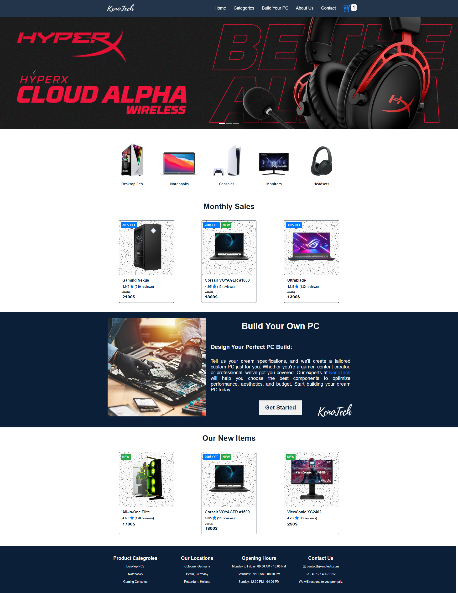

# KenoTech

A comprehensive ecommerce platform for a hardware store developed with JavaScript and React. The design is responsive, ensuring optimal performance across various devices. This project showcases my ability to create functional and visually appealing ecommerce solutions.

## Key Features
- Intuitive product search and filtering.
- Secure checkout process.
- User account management system.
- Responsive design for web and mobile.

## Technologies Used
- JavaScript
- React
- Bootstrap

## Live Demo
[KenoTech](https://keno-tech.vercel.app/)

